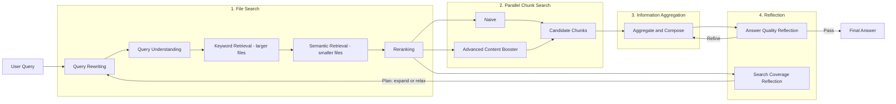

This post outlines a high-level design for a Knowledge Base (KB) Assistant exposed via an MCP server that integrates with the Dify KB backend, with optional reflection, context boosting, and reranking. It's designed to plug easily into other orchestration pipelines (including RAG).

## Flowchart Overview

#### File search

First thing first, how can we retrieve menaingfule and important files under many files?  Here we introduce standard search strategy:
> Query understanding  -> Query rewriting -> funnel retrieval: keyword retrieval on larger files -> semantic retrieval on smaller files -> reranking

- Query rewriter controlled by llm for asking keep the entites (person/organization) first and based
on the understanding like domain specific check to boost up the import content
- and then go standard multi-stage information retrieval 
- we will get the (file name, score) by reranking based on the original user query

## Key Components

- **MCP Server**: Exposes `kb_assistant` tool, performs auth via decorator, forwards to service.
- **Auth Middleware**: Validates headers, short-circuits unauthorized requests.
- **KB Assistant Service**: Orchestrates parsing `dataset_info`, intention extraction, searches, merging, reranking, and final answer generation.
- **Dify KB Backend**: Provides document search for naive/advanced strategies.
- **LLM API**: Used for keyword generation, answer drafting, and optional reflection.
- **Rerank API**: Optional reranking when available and useful.

## Toggling Features

- **Content booster**: If enabled, expands context and merges/dedupes results before answering.
- **Reflection**: If enabled, runs a self-critique pass, and retries if quality is low.
- **Reranking**: Applied when a reranker is configured and results meet a threshold for usefulness.

## Response Shape

The MCP response returns the final answer along with:
- sources and snippets,
- timings/profiling info,
- flags indicating whether content booster, rerank, and reflection were used,
- and intermediate diagnostics (keywords, search stats) when verbose.

