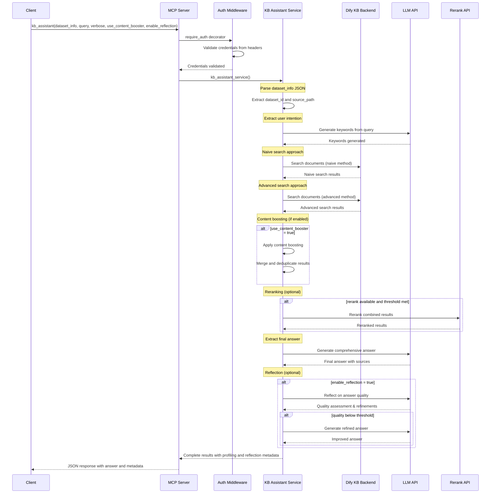

This post outlines a high-level design for a Knowledge Base (KB) Assistant exposed via an MCP server that integrates with the Dify KB backend, with optional reflection, content boosting, and reranking. It's designed to plug easily into other orchestration pipelines (including RAG).

## Sequence Diagram

To render the following Mermaid diagram on this site, we include a minimal script block to initialize Mermaid when the page loads.

## Key Components

- **MCP Server**: Exposes `kb_assistant` tool, performs auth via decorator, forwards to service.
- **Auth Middleware**: Validates headers, short-circuits unauthorized requests.
- **KB Assistant Service**: Orchestrates parsing `dataset_info`, intention extraction, searches, merging, reranking, and final answer generation.
- **Dify KB Backend**: Provides document search for naive/advanced strategies.
- **LLM API**: Used for keyword generation, answer drafting, and optional reflection.
- **Rerank API**: Optional reranking when available and useful.

## Toggling Features

- **Content booster**: If enabled, expands context and merges/dedupes results before answering.
- **Reflection**: If enabled, runs a self-critique pass, and retries if quality is low.
- **Reranking**: Applied when a reranker is configured and results meet a threshold for usefulness.

## Response Shape

The MCP response returns the final answer along with:
- sources and snippets,
- timings/profiling info,
- flags indicating whether content booster, rerank, and reflection were used,
- and intermediate diagnostics (keywords, search stats) when verbose.

