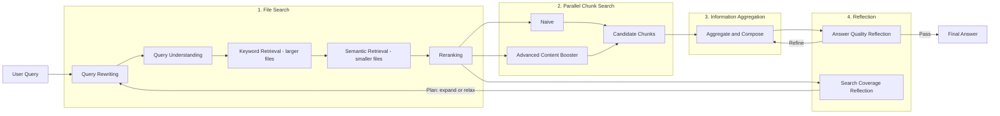

This post outlines a high-level design for a Knowledge Base (KB) Assistant exposed via an MCP server that integrates with the Dify KB backend, with optional reflection, context boosting, and reranking. It's designed to plug easily into other orchestration pipelines (including RAG).

## Flowchart Overview

### File search

The first challenge is: how do we find the most meaningful and relevant files when there are so many files saved in knoweldge base? To solve this, we use a structured search strategy:

> Query intent detetor → Query rewriter → Funnel retrieval: Start with keyword retrieval on larger files, then apply semantic retrieval on smaller, more focused files, and finally rerank the results.

For the query intent detector and query rewriter, implemented with corresponding instructions to LLMs (e.g., gpt-4o), the main goal is to understand what the user is trying to do — for example, finding an exact sentence or article from a file, comparing multiple files, or focusing on a specific domain like healthcare. The system also identifies key entities, such as people or organizations, and passes this information to the query rewriter. The rewriter then adjusts the query by adding or relaxing context and motivation to make it more effective. After that, we run a multi-layer retrieval process: starting with a broad keyword search, then narrowing it down with more focused semantic retrieval. Finally, we adope the rerank model (e.g., [jina reranker](https://huggingface.co/jinaai/jina-reranker-v2-base-multilingual)) to rerank the results based on the original user query to produce the top-k tuples ((file1, score1), (file2, score2), ...).

For example, let’s say we load the contract documents from [ContractNLI](https://stanfordnlp.github.io/contract-nli) into our knowledge base. If a user asks
> What confidentiality obligations remain in effect after the NDA expires or is terminated for evaluation of clinical cases in University of Michigan

The file search step will pick up the user’s intent (looking for a specific clause within the healcare domain) and determine there’s only one relevant file to extract the answer from. Note in this case, the ground truth lives in:

> standard_clinical_trial_nda2.pdf (Sections 5.2, 5.3, 6)

### Parallel Chunk Search
Once the relevant files are identified, the parallel chunk search step runs two retrieval strategies in parallel:
	1.	A naive search using the original user query.
	2.	A boosted search that expands the query with additional keywords.

The content booster is a separate LLM-based tool. It generates domain-specific keyword variations (based on the domain inferred in the file search stage) to produce N different query combinations—while preserving the original meaning through controlled instructions. This helps capture more relevant chunks without drifting away from the user’s intent.

### Chunk Aggregation
How we aggregate chunks depends on the user’s intent from the file search step.

1. Single-file or small file set (clause lookup)
When the user’s query targets specific clauses or paragraphs in just a few files, we treat the task more like a ranking problem where we can leverage the relevance socre per file from the file search step.
	-	We first rank the files based on the aggregated relevance of their chunks.
	-	If the query is about a legal clause, we preserve the original wording as much as possible.
	-	Otherwise, we generate a concise summary from the relevant chunks.

2. Multi-file comparison (cross-file analysis):
When the user wants to compare multiple files, we treat the task like a linking problem.
	-	We identify and align key entities across files.
	-	Then we aggregate and summarize the results by comparison, applying a defined set of measures or dimensions (e.g., clause differences, obligations, dates, or entities).

This step can be modularized, allowing additional engineering actions or post-processing layers (e.g., entity alignment modules, structured reporting, or visualization components).

### Reflection
We run two lightweight reflection passes to improve reliability. Both are LLM-prompted with structured outputs and can be toggled/configured.

- Search coverage reflection
  - Signals: few/no high-score chunks, missing query entities in retrieved text, low source diversity.
  - Action: produce a plan to expand or relax terms, then re-run file/chunk search with a revised query (broaden entities, synonyms/time ranges). Bounded to max rounds (default: 1).

- Answer quality reflection
  - Rubric: grounding (citations present and relevant), completeness (addresses intent), internal consistency, and specificity.
  - Action: if score < min_quality_score (default: 0.7), re-compose the answer from top chunks; otherwise pass.

Implementation notes
- Controls: `enable_reflection` (bool), `max_reflection_rounds` (int), `min_quality_score` (float).
- Outputs: the MCP response includes `reflection.plan`, `revised_query` (if any), and per-criterion scores to aid debugging.
s

### MCP Implementa
